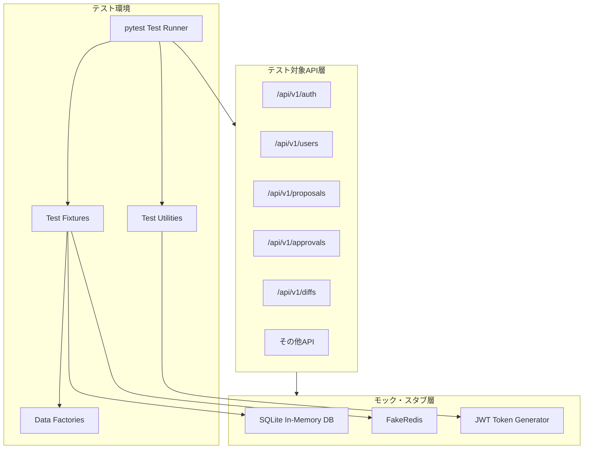

# 詳細設計書 - APIエンドポイントテスト実装

## 1. アーキテクチャ概要

### 1.1 システム構成図



### 1.2 技術スタック

- **言語**: Python 3.12+
- **テストフレームワーク**: pytest 8.3.4, pytest-asyncio 0.26.0
- **HTTPクライアント**: httpx 0.28.1
- **データベース**: SQLite (aiosqlite 0.21.0) - インメモリ使用
- **Redisモック**: fakeredis 2.20.1
- **カバレッジ**: pytest-cov
- **データ生成**: Factory Boy パターン（手動実装）
- **日時モック**: freezegun 1.4.0

## 2. コンポーネント設計

### 2.1 コンポーネント一覧

| コンポーネント名 | 責務 | 依存関係 |
|-----------------|------|----------|
| TestFixtures | テスト環境の初期化・クリーンアップ | SQLite, FakeRedis |
| DataFactories | テストデータの生成 | SQLAlchemy Models |
| AuthHelpers | 認証トークン生成・権限設定 | JWT, User Models |
| APIClients | HTTPリクエストの実行 | httpx, FastAPI |
| Assertions | レスポンス検証・カスタムアサーション | pytest |
| TestScenarios | E2Eシナリオの実行 | All Components |

### 2.2 各コンポーネントの詳細

#### TestFixtures (conftest.py拡張)

- **目的**: テスト環境のセットアップと破棄を管理
- **公開インターフェース**:
```python
@pytest.fixture
async def test_db() -> AsyncSession:
    """テスト用データベースセッション"""

@pytest.fixture
async def test_client(test_db) -> AsyncClient:
    """認証済みHTTPクライアント"""

@pytest.fixture
async def test_users() -> Dict[str, User]:
    """ロール別テストユーザー"""
    return {
        "admin": admin_user,
        "approver": approver_user,
        "user": normal_user
    }
```

- **内部実装方針**: 
  - 各テストごとにデータベースをリセット
  - トランザクションロールバックによる高速化
  - フィクスチャのスコープ最適化

#### DataFactories

- **目的**: 一貫性のあるテストデータ生成
- **公開インターフェース**:
```python
class UserFactory:
    @staticmethod
    async def create(
        db: AsyncSession,
        role: str = "user",
        approval_group: Optional[ApprovalGroup] = None
    ) -> User

class RevisionFactory:
    @staticmethod
    async def create(
        db: AsyncSession,
        status: str = "draft",
        proposer: Optional[User] = None,
        approver: Optional[User] = None
    ) -> Revision

class ArticleFactory:
    @staticmethod
    async def create(
        db: AsyncSession,
        approval_group: Optional[ApprovalGroup] = None,
        info_category: Optional[InfoCategory] = None
    ) -> Article
```

- **内部実装方針**:
  - デフォルト値の自動設定
  - 関連エンティティの自動生成オプション
  - ユニーク制約の自動回避（カウンター使用）

## 3. データフロー

### 3.1 テスト実行フロー

```
1. Test Setup
   ├─ Database初期化
   ├─ Redis初期化
   └─ 基本データ作成（Groups, Categories）

2. Test Execution
   ├─ テストユーザー作成
   ├─ 認証トークン生成
   ├─ APIリクエスト実行
   └─ レスポンス検証

3. Test Teardown
   ├─ Database rollback
   └─ Redis clear
```

### 3.2 データ変換

- **入力データ形式**: Pydantic Schemas (RevisionCreate, UserLogin等)
- **処理過程**: 
  - リクエストボディのJSON変換
  - JWT トークンのヘッダー付与
  - マルチパートフォームデータ対応
- **出力データ形式**: JSON レスポンス → Pydantic モデル/Dict

## 4. APIインターフェース

### 4.1 内部API（テストヘルパー）

```python
# tests/utils/auth.py
async def get_auth_token(client: AsyncClient, user: User) -> str:
    """ユーザーの認証トークンを取得"""

async def create_authenticated_client(
    client: AsyncClient, 
    user: User
) -> AsyncClient:
    """認証済みクライアントを作成"""

# tests/utils/assertions.py
def assert_revision_response(
    response: Dict,
    expected_revision: Revision
):
    """修正案レスポンスの検証"""

def assert_permission_denied(response: Response):
    """権限エラーの検証"""
```

### 4.2 外部API（テスト対象）

12種類のAPIグループ全てをテスト:
- `/api/v1/auth/*` - 認証
- `/api/v1/users/*` - ユーザー管理
- `/api/v1/proposals/*` - 修正案提案
- `/api/v1/approvals/*` - 承認ワークフロー
- `/api/v1/diffs/*` - 差分表示
- `/api/v1/revisions/*` - 修正案基本操作
- `/api/v1/articles/*` - 記事管理
- `/api/v1/info-categories/*` - カテゴリ管理
- `/api/v1/approval-groups/*` - 承認グループ
- `/api/v1/notifications/*` - 通知
- `/api/v1/system/*` - システム管理
- `/api/v1/analytics/*` - 分析・統計

## 5. エラーハンドリング

### 5.1 エラー分類

- **認証エラー (401)**: 無効なトークン、期限切れトークンのテスト
- **権限エラー (403)**: ロール別アクセス制御の境界テスト
- **検証エラー (422)**: 入力バリデーションエラーのテスト
- **状態エラー (400)**: ビジネスロジック違反のテスト
- **NotFound (404)**: 存在しないリソースアクセステスト

### 5.2 エラー検証戦略

```python
# カスタム例外の検証
assert response.status_code == 400
assert response.json()["detail"]["error_code"] == "PROPOSAL_STATUS_ERROR"

# 一般的なエラーパターン
@pytest.mark.parametrize("invalid_data", [
    {"approver_id": None},  # 必須フィールド欠落
    {"status": "invalid"},  # 無効な列挙値
    {"after_publish_start": "invalid-date"}  # 形式エラー
])
async def test_validation_errors(client, invalid_data):
    """バリデーションエラーの包括的テスト"""
```

## 6. セキュリティ設計

### 6.1 認証・認可テスト

```python
# 権限マトリクステスト
PERMISSION_MATRIX = {
    "GET /api/v1/users/": ["admin"],
    "POST /api/v1/proposals/": ["user", "approver", "admin"],
    "POST /api/v1/approvals/{id}/decide": ["approver", "admin"],
}

@pytest.mark.parametrize("endpoint,allowed_roles", PERMISSION_MATRIX.items())
async def test_role_based_access(endpoint, allowed_roles):
    """ロールベースアクセス制御の検証"""
```

### 6.2 データ保護テスト

- **SQLインジェクション**: 悪意のある入力でのテスト
- **XSS対策**: HTMLタグを含む入力のサニタイズ確認
- **データ漏洩防止**: 権限外データへのアクセス試行

## 7. テスト戦略

### 7.1 単体テスト

- **カバレッジ目標**: 80%以上
- **テストフレームワーク**: pytest + pytest-asyncio
- **モック戦略**: 
  - データベース: SQLite インメモリ
  - Redis: FakeRedis
  - 外部サービス: なし（独立システム）

### 7.2 統合テスト

```python
class TestProposalWorkflow:
    """修正案ワークフロー統合テスト"""
    
    async def test_complete_workflow(self):
        """作成→提出→承認の完全フロー"""
        # 1. 修正案作成
        proposal = await create_proposal()
        
        # 2. 提出
        await submit_proposal(proposal.id)
        
        # 3. 承認
        await approve_proposal(proposal.id)
        
        # 4. 通知確認
        assert_notification_sent()
```

### 7.3 パフォーマンステスト

```python
@pytest.mark.performance
async def test_bulk_operations():
    """大量データでのパフォーマンステスト"""
    # 1000件の修正案でテスト
    revisions = await create_bulk_revisions(1000)
    
    start_time = time.time()
    response = await client.get("/api/v1/revisions/")
    elapsed = time.time() - start_time
    
    assert elapsed < 3.0  # 3秒以内
    assert len(response.json()) == 1000
```

## 8. パフォーマンス最適化

### 8.1 想定される負荷

- **同時接続**: 100ユーザー並行アクセステスト
- **データ量**: 10,000件の修正案でのページネーションテスト
- **大容量コンテンツ**: 10MBのテキストデータでの差分表示

### 8.2 最適化方針

- **フィクスチャキャッシュ**: セッションスコープの活用
- **並行実行**: pytest-xdist による並列テスト（将来）
- **トランザクション分離**: テスト間の独立性確保

## 9. デプロイメント

### 9.1 CI/CD統合

```yaml
# GitHub Actions設定
test:
  runs-on: windows-latest
  steps:
    - name: Run Tests
      run: |
        uv install
        uv run pytest -v --cov=app --cov-report=html
    - name: Upload Coverage
      uses: codecov/codecov-action@v3
```

### 9.2 テスト環境設定

```python
# .env.test
DATABASE_URL=sqlite+aiosqlite:///:memory:
REDIS_URL=redis://localhost:6379/1
JWT_SECRET_KEY=test-secret-key
ENVIRONMENT=testing
```

## 10. 実装上の注意事項

### 10.1 テストの独立性

- 各テストは他のテストに依存しない
- テストの実行順序に依存しない
- グローバル状態を使用しない

### 10.2 テストデータ管理

- ファクトリーパターンで一貫性確保
- ユニーク制約違反の自動回避
- 関連データの自動生成

### 10.3 非同期処理

- `pytest-asyncio`のマーカー適用
- 非同期フィクスチャの適切な使用
- デッドロックの回避

### 10.4 エラーメッセージ

- アサーションには説明的なメッセージを含める
- 失敗時のデバッグ情報を充実させる
- カスタムアサーション関数の活用

### 10.5 テストの保守性

- パラメータ化テストの活用
- 共通処理のヘルパー関数化
- テストコードのDRY原則遵守